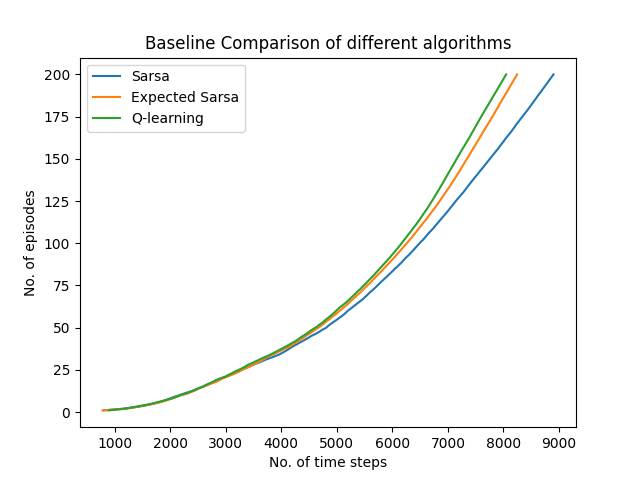

# windy-gridworld

A simple python implementation of the Windy Gridworld problem from [Sutton and Barto](http://incompleteideas.net/book/RLbook2020.pdf) intended to serve pedagogical purposes.

## Details
* Run `python3 main.py` to generate plots for the below mentioned tasks. It supports a few comand line arguments too. 
* Task 1: Example 6.5: An -greedy SARSA agent with movement allowed in four directions.
* Task 2: Exercise 6.9: Now the agent can move in eight directions.
* Task 3: Exercise 6.10: Now the wind isn't deterministic.
* Task 4: A comparison of Q-learning, SARSA, and Expected SARSA for this problem.
* The file `environment.py` helps modularize the code for returning rewards and next states for the actions taken by the agent.
* The file `agent.py` has the learning algorithms along with methods to manage agent data.

  

This project was done for a course assignment of IITB's [CS 747](https://www.cse.iitb.ac.in/~shivaram/teaching/old/cs747-a2020/index.html): Foundations of Intelligent and Learning Agents. The assignment's problem statement can be found [here](https://www.cse.iitb.ac.in/~shivaram/teaching/old/cs747-a2020/pa-3/programming-assignment-3.html). 

